# ASMonAzureRedHatOpenShift [WIP]


## Introduction

Official **OpenShift** support has been added to **Anypoint Service Mesh v1.2**!

This cookbook will walk you through the process of installing **Anypoint Service Mesh** on **Microsoft Azure Red Hat OpenShift**. You will deploy a demo application and secure using Anypoint Service Mesh.

***To log issues***, click here to go to the [github](https://github.com/mulesoft-consulting/ASMonAzureRedHatOpenShift/issues) repository issue submission form.

## Objectives

- **[Create Azure Red Hat OpenShift (ARO) Cluster](#installaro)**
	- [**STEP 1:** Create Azure Resource Group](#step1)
  - [**STEP 2:** Create Azure Virtual Network](#step2)
  - [**STEP 3:** Add an empty Azure Subnet for Master Nodes](#step3)
  - [**STEP 4:** Add an empty Azure Subnet for Worker Nodes](#step4)
  - [**STEP 5:** Disable Azure Subnet Private Endpoints for Master Subnet](#step5)
  - [**STEP 6:** Create Cluster](#step6)
  - [**STEP 7:** Verify Cluster and Connect](#step7)

- **[Install Istio](#installistio)**
	- [**STEP 8:** Download and Install Istio CLI](#step8)
	- [**STEP 9:** Install Istio Using CLI](#step9)
- **[Deploy Demo Application](#deploydemo)**
	- [**STEP 10:** Clone Demo Application](#step10)
	- [**STEP 11:** Deploy Demo Application](#step11)
- **[Install Anypoint Service Mesh](#installasm)**
	- [**STEP 12:** Install Anypoint Service Mesh](#step12)
	- [**STEP 13:** Install Anypoint Service Mesh Adapter](#step13)
	- [**STEP 14:** Create APIs](#step14)
	- [**STEP 15:** Binding APIs with Services](#step15)
- **[Apply API Management Policies](#applypolicy)**
	- [**STEP 16:** Apply Rate Limiting Policy to Customer API](#step16)
	- [**STEP 17:** Apply Client ID enforcement Policy to Payment API](#step17)
- **[Report & Monitor API Analytics](#reportmonitoranalytics)**
	- [**STEP 18:** View Analytics of Customer API & Payment API](#step18)
	- [**STEP 19:** View Dashboards of Customer API & Payment API](#step19)
- **[Cleanup (Optional)](#cleanup)**
	- [**STEP 20:** Cleanup APIs & Bindings](#step20)

## Required Artifacts

- The following lab requires an Enterprise Azure account.
- Enable Anypoint Service Mesh in your Anypoint Platform Organization.

For complete instructions please visit [MuleSoft Documentation](https://docs.mulesoft.com/service-mesh/latest/)

<a id="installaro"></a>
## Create Azure Red Hat OpenShift (ARO) Cluster

- From any browser, go to the URL to access [Azure Portal](https://portal.azure.com/).

- Open Terminal window. If you don't already have the **Azure CLI** installed following the [Install Azure CLI](https://docs.microsoft.com/en-us/cli/azure/install-azure-cli?view=azure-cli-latest) to first install Azure CLI.

<a id="step1"></a>
### **STEP 1**: Create Azure Resource Group

- Run the following command
```bash
az group create --name aro-rg-westus --location westus
```
  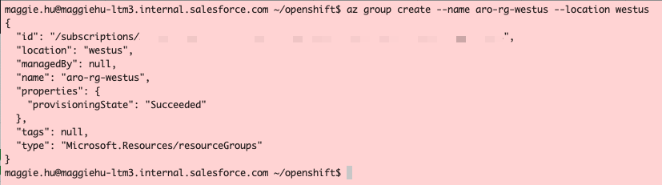	

<a id="step2"></a>
### **STEP 2**: Create Azure Virtual Network

- Run the following command
```bash
az network vnet create --resource-group aro-rg-westus --name aro-vnet --address-prefixes 10.0.0.0/22
```
  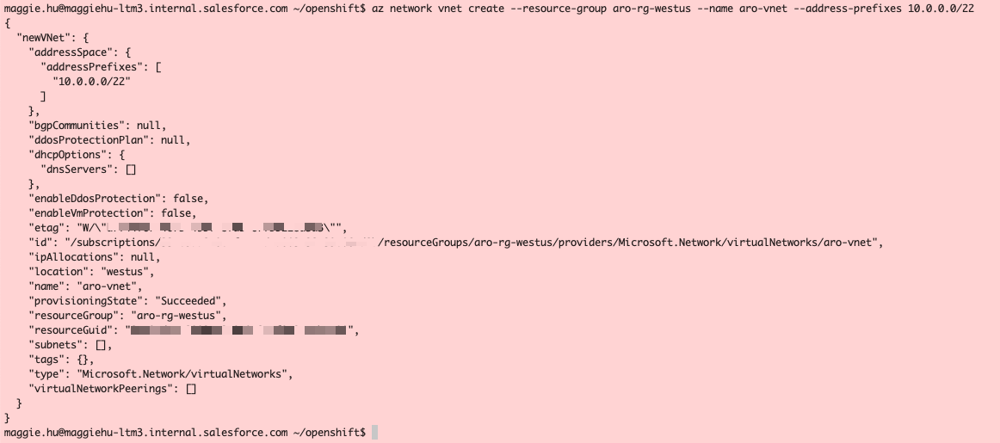	
  
<a id="step3"></a>
### **STEP 3**: Add an empty Azure Subnet for Master Nodes

- Run the following command
```bash
az network vnet subnet create \
--resource-group aro-rg-westus \
--vnet-name aro-vnet \
--name master-subnet \
--address-prefixes 10.0.0.0/23 \
--service-endpoints Microsoft.ContainerRegistry
```
  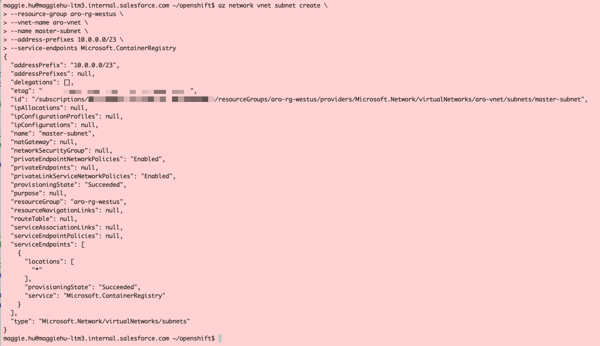	


<a id="step4"></a>
### **STEP 4**: Add an empty Azure Subnet for Worker Nodes

- Run the following command
```bash
az network vnet subnet create \
--resource-group aro-rg-westus \
--vnet-name aro-vnet \
--name worker-subnet \
--address-prefixes 10.0.2.0/23 \
--service-endpoints Microsoft.ContainerRegistry
```
  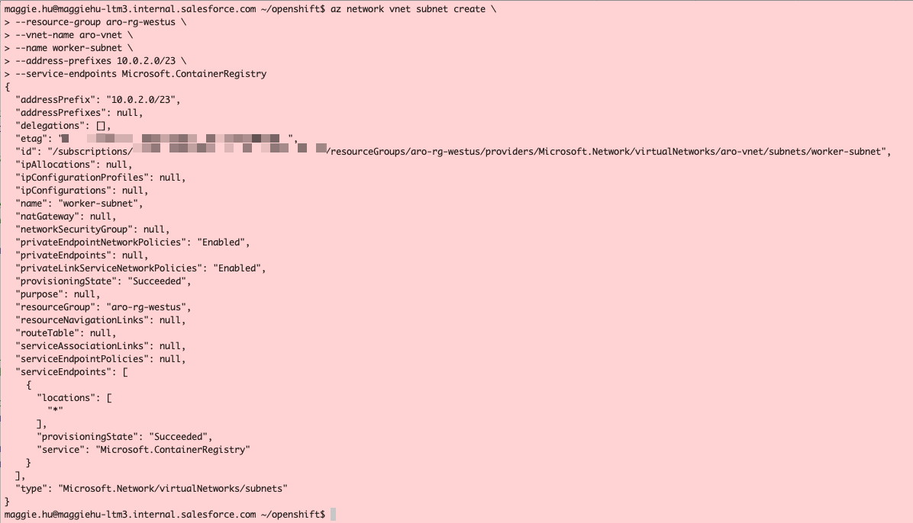	

<a id="step5"></a>
### **STEP 5**: Disable Azure Subnet Private Endpoints for Master Subnet

- Run the following command
```bash
az network vnet subnet update \
--name master-subnet \
--resource-group aro-rg-westus \
--vnet-name aro-vnet \
--disable-private-link-service-network-policies true
```
  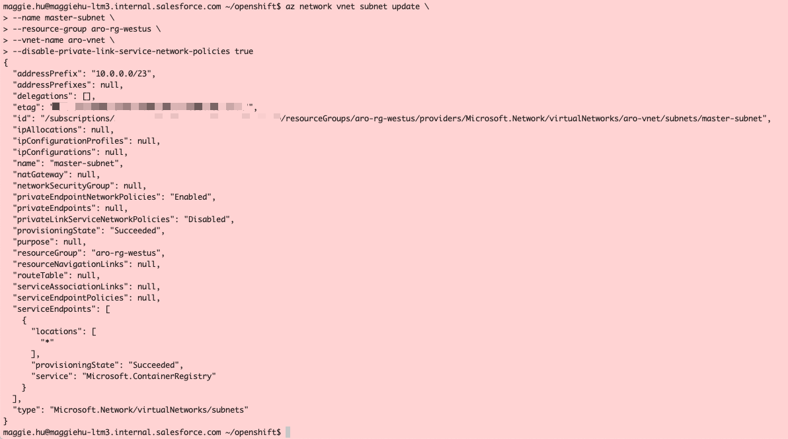	

<a id="step6"></a>
### **STEP 6**: Create Cluster

- Run the following command
```bash
az aro create \
--resource-group aro-rg-westus \
--name aro-cluster \
--vnet aro-vnet \
--master-subnet master-subnet \
--worker-subnet worker-subnet \
--pull-secret @pull-secret.txt
```
  	

<a id="step7"></a>
### **STEP 7**: Verify Cluster and Connect

- Run the following command
```bash
az aro list-credentials \
--name aro-cluster \
--resource-group aro-rg-westus
```
  	

```bash
az aro show \
--name aro-cluster \
--resource-group aro-rg-westus \
--query "consoleProfile.url" -o tsv
```
Log in to the web admin console.
  
  
  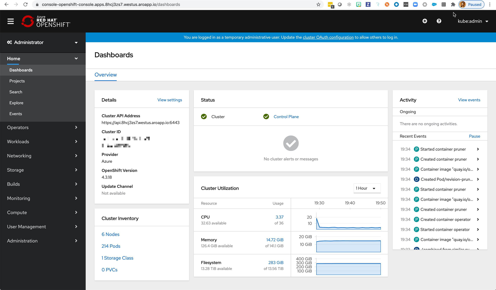

At the top right corner, click on the question-mark circle, CommandLine Tools, and download the appropriate oc - OpenShift Command Line Interce (CLI). The ***oc*** tool is just the OpenShift version of ***kubectl***, with additional CLI options specifically for OpenShift.
  
  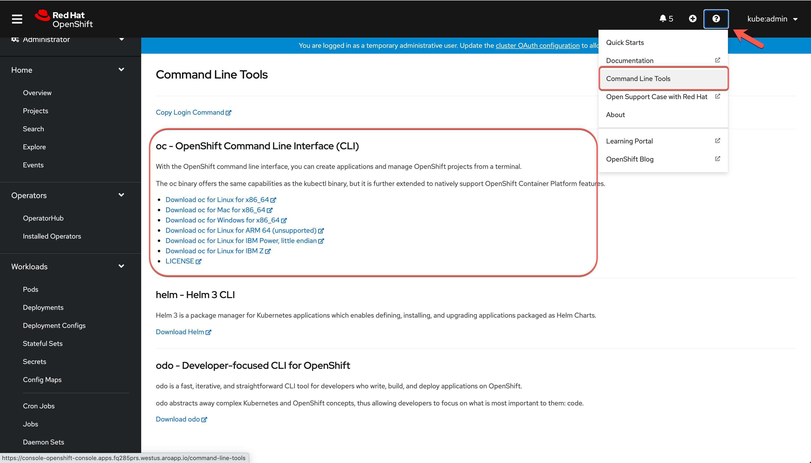


Connect via the CLI:
```bash
apiServer=$(az aro show -g aro-rg-westus -n aro-cluster --query apiserverProfile.url -o tsv)

oc login $apiServer -u <login> -p <password>
```
  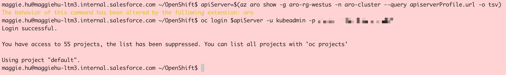

Verify the current Kubenetes context has been configured to point to the ARO cluster.
```bash
oc config current-context
```
  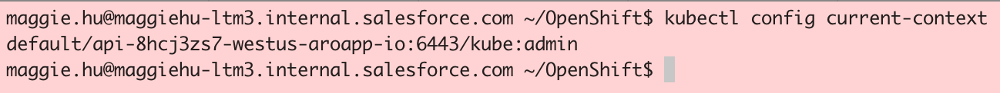

<a id="installistio"></a>
## Install Istio

<a id="step8"></a>
### **STEP 8**: Download and Install Istio CLI

- To install **Istio** we will be using the **Istio CLI**. For completed instructions [Istio Docs](https://istio.io/docs/setup/install/istioctl/)

- Use the following command to download **Istio CLI** into your directory of choice and supported by Anypoint Service Mesh (1.7.x or 1.8.x at this time).

```bash
curl -L https://istio.io/downloadIstio | ISTIO_VERSION=<x.x.x> sh -
```

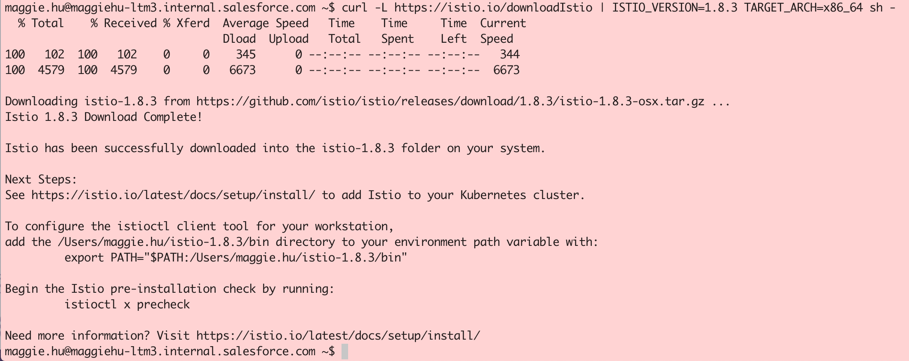

- Change into newly downloaded directory (the Istio version downloaded and to be installed)

```bash
cd istio-<x.x.x>/
```

- Add current directory directly to path

```bash
export PATH=$PWD/bin:$PATH
```


<a id="step9"></a>
### **STEP 9**: Install Istio using CLI
- To install **Istio** we will be using the **Istio CLI**.

- By default, OpenShift doesn’t allow containers running with user ID 0. You must enable containers running with UID 0 for Istio’s service accounts by running the command below.

```bash
oc adm policy add-scc-to-group anyuid system:serviceaccounts:istio-system
```

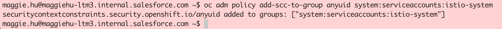

- From the **istio** directory, install Istio using the OpenShift profile:

```bash
istioctl install --set profile=openshift
```

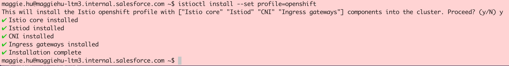

- After the installation is complete, expose an OpenShift route for the ingress gateway

```bash
oc -n istio-system expose svc/istio-ingressgateway --port=http2
```
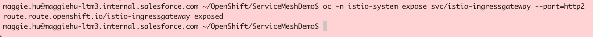

- Verify that **Istio** has been installed. You should now see the **istio-system** namespace

```bash
oc get namespaces
```

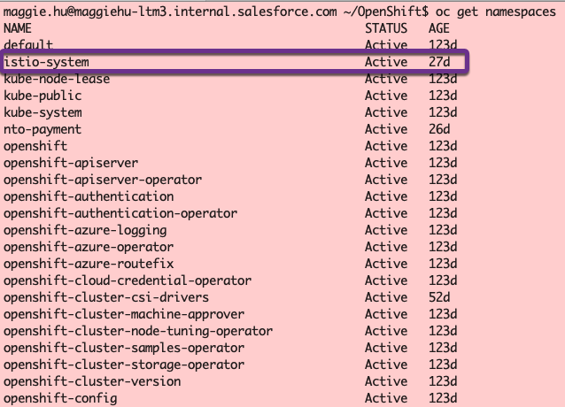

<a id="deploydemo"></a>
## Deploy Demo Application

<a id="step10"></a>
### **STEP 10**: Clone Demo Application

- For our demo application will will be using **Northern Trail Outfitters** shopping cart application. This web based UI will call several services to complete the order.

- Clone the demo application git repository onto your local machine.

```bash
git clone https://github.com/mulesoft-consulting/ServiceMeshDemo -b 1PlatformDemo
```

- Change to the **ServiceMeshDemo** directory and list out the contents to verify that the repository has been created correctly

```bash
cd ServiceMeshDemo/
ls
```

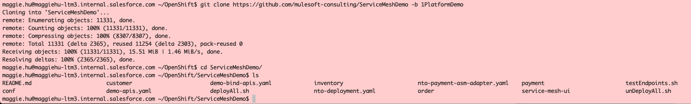

<a id="step11"></a>
### **STEP 11**: Deploy Demo Application

- We will now deploy the demo application to your kubernetes cluster. The deployment script takes the namespace as a parameter. We will be using **nto-payment** for namespace

```bash
oc create namespace nto-payment
oc label ns nto-payment istio-injection=enabled
oc create -f nto-deployment.yaml -n nto-payment
```

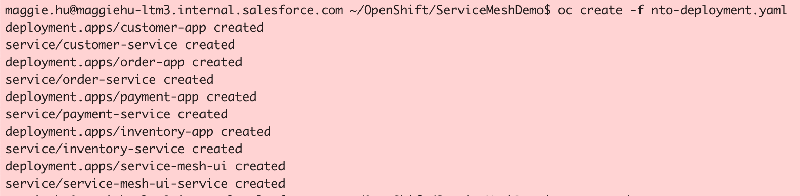

- The Istio sidecar injected into each application pod runs with user ID 1337, which is not allowed by default in OpenShift. To allow this user ID to be used, execute the following commands for the **nto-payment** namespace. 

```bash
oc adm policy add-scc-to-group privileged system:serviceaccounts:nto-payment

oc adm policy add-scc-to-group anyuid system:serviceaccounts:nto-payment
```

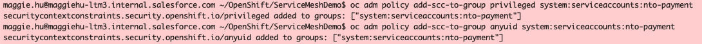

- CNI on OpenShift is managed by Multus, and it requires a NetworkAttachmentDefinition to be present in the application namespace in order to invoke the istio-cni plugin.

```bash
cat <<EOF | oc -n nto-payment create -f -
apiVersion: "k8s.cni.cncf.io/v1"
kind: NetworkAttachmentDefinition
metadata:
  name: istio-cni
EOF
```
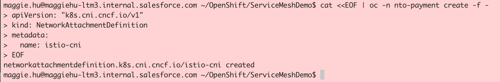

- You can monitor the deployment with the following commands

```bash
oc get pods -n nto-payment
oc get services -n nto-payment
```

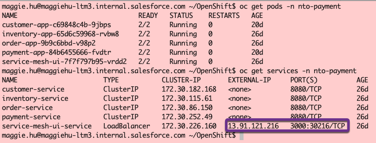

- Once all services are running you can test out the application. To access the application open you browser and go to the following URL

```bash
http://<EXTERNAL-IP>:3000
```


- To test out the application follow these steps:

    - Select Item to purchase
    - Click **ADD TO CART**
    - Click **CHECKOUT**
    - Leave default email and click **CONTINUE**
    - Click **AUTHORIZE PAYMENT**
    - Last click **PLACE ORDER**


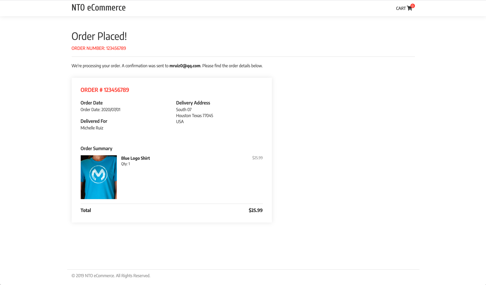

<a id="installasm"></a>
## Install Anypoint Service Mesh

<a id="step12"></a>
### **STEP 12**: Install Anypoint Service Mesh

For complete instructions and documentation please visit [MuleSoft Docs](https://docs.mulesoft.com/service-mesh/latest/)

- First lets enable API Analytics by setting the **disableMixerHttpReports** flag to false:

```bash
oc -n istio-system get cm istio -o yaml | sed -e 's/disableMixerHttpReports: true/disableMixerHttpReports: false/g' | oc replace -f -
```

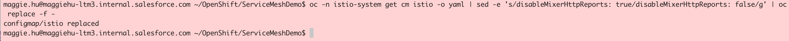

- Download the latest Anypoint Service Mesh CLI and make it executable

```bash
mkdir -p $HOME/.asm && curl -Ls http://anypoint.mulesoft.com/servicemesh/xapi/v1/install > $HOME/.asm/asmctl && chmod +x $HOME/.asm/asmctl && export PATH=$PATH:$HOME/.asm

asmctl version
```

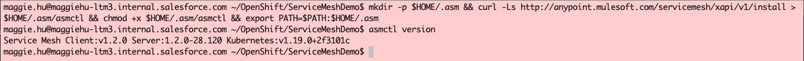

- Now we are ready to install Anypoint Service Mesh. To do this we will call **asmctl install**. This command requires 3 parameters
    - Client Id from API Manager (Environment or Business Group)
    - Client Secret from API Manager (Environment or Business Group)
    - Service Mesh license

- If you are not familiar with how to get Client Id and Client Secret, navigate to **API Manager** and click on the **Environment Information** button.

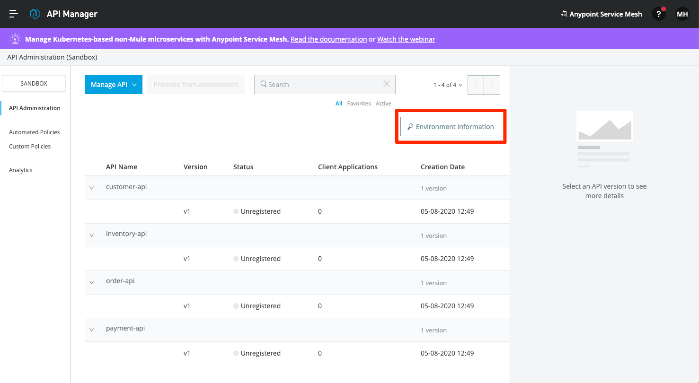

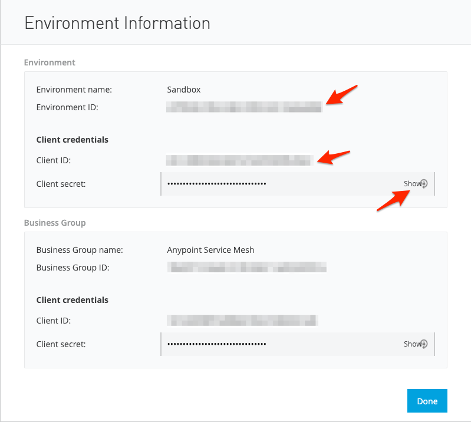

```bash
asmctl install
```


- Verify that Anypoint Service Mesh has been installed correctly with the following command

```bash
oc get pods -n service-mesh
```

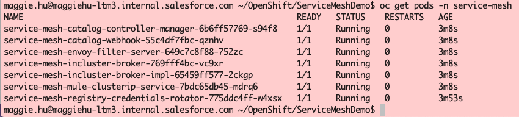

<a id="step13"></a>
### **STEP 13**: Install Anypoint Service Mesh Adapter

- Next we want to deploy the Anypoint Service Mesh adapter in each namespace that we want to monitor APIs. For this example we will just be doing the **nto-payment** namespace that contains the demo application.

- To deploy the ASM Adapter we will be using a Kubernetes custom resource definition (CRD). In the **ServiceMeshDemo** repository we have create the file **nto-payment-asm-adapter.yaml** that can modified.

    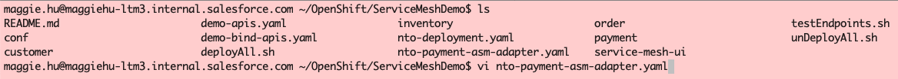

    

- Replace **```<CLIENT ID>```** and **```<CLIENT SECRET>```** with values for your environment. Save file and run the following command

```bash
oc apply -f nto-payment-asm-adapter.yaml
```

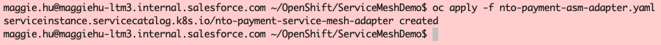

- Use the following command to monitor the progress. Wait for status to change to **Ready**

```bash
asmctl adapter list
```

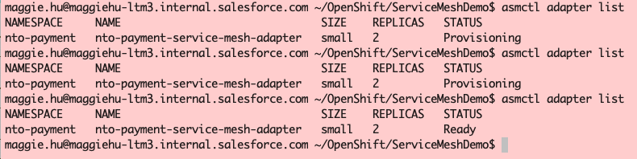

- After you provision the adapter, you must set the `istio-injection=enabled` label on the namespace by runnning the following command

```bash
oc label ns nto-payment istio-injection=enabled
```

- Redeploy all the existing applications in the namepsace. See Step 6.2 in [MuleSoft Docs](https://docs.mulesoft.com/service-mesh/1.0/provision-adapter-configure-service-mesh-CLI)

```bash
oc get deployments -n nto-payment
```

```bash
oc -n nto-payment patch deploy customer-app --type=json -p='[{"op": "replace", "path": "/spec/template/metadata/labels/service-mesh.mulesoft.com","value":"enable"}]'
```

```bash
oc -n nto-payment patch deploy inventory-app --type=json -p='[{"op": "replace", "path": "/spec/template/metadata/labels/service-mesh.mulesoft.com","value":"enable"}]'
```

```bash
oc -n nto-payment patch deploy order-app --type=json -p='[{"op": "replace", "path": "/spec/template/metadata/labels/service-mesh.mulesoft.com","value":"enable"}]'
```

```bash
oc -n nto-payment patch deploy payment-app --type=json -p='[{"op": "replace", "path": "/spec/template/metadata/labels/service-mesh.mulesoft.com","value":"enable"}]'
```

```bash
oc -n nto-payment patch deploy service-mesh-ui --type=json -p='[{"op": "replace", "path": "/spec/template/metadata/labels/service-mesh.mulesoft.com","value":"enable"}]'
```

```bash
oc get pods -n nto-payment
```

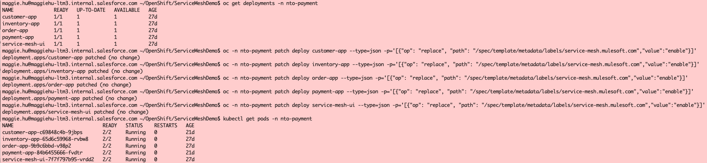
- Verify the Envoy sidecar is injected within each pod in the Kubernetes Cluster by running the following command

```bash
asmctl management check sidecar --namespace=nto-payment
```

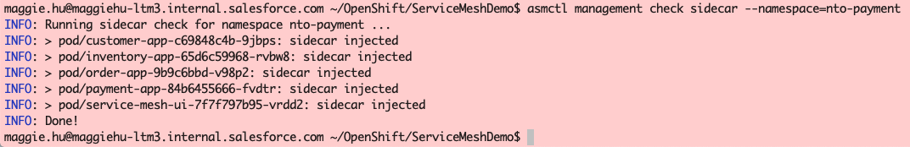

<a id="step14"></a>
### **STEP 14**: Create APIs

- We will now use Anypoint Service Mesh auto discovery to create API's in Anypoint Platform. We will create API's for Customer, Inventory, Order and Payments services that are used by the demo application.

- Before creating the APIs, ensure the Anypoint Platform user has **API Manager Environment Administrator** permission, in addition to **Manage APIs Configuration**. This can be done by your organization admin in **Access Management*.


 

- Modify the Kubernetes custom resource definition (CRD) file **demo-apis.yaml**. 

- For each API, replace **```<ENV ID>```** with the values for your environment.

- If you are not familiar with how to get Environment Id, navigate to **API Manager** and click on the **Environment Information** button.

- You'll need to [Configure Connected Apps](https://docs.mulesoft.com/service-mesh/latest/obtain-connected-apps-credentials) to get the client credentials into your CRD file.

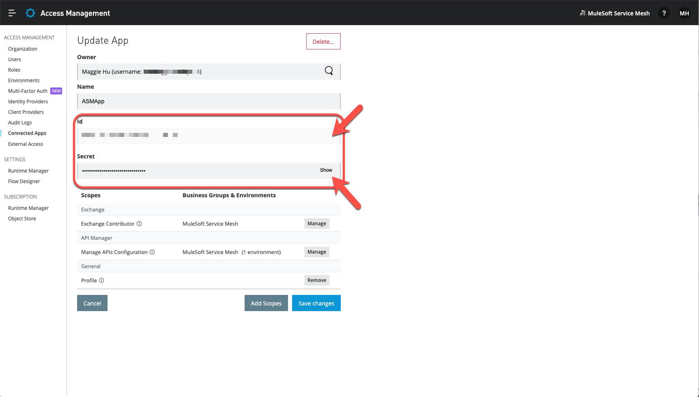

- For each API, replace **```<clientId>```** and **```<clientSecret>```** with the values from the connected app configured. Keep in mind that these are not the same as the ones from either the environment or business group in API Manager.

**NOTE:** If you run this multiple times you might need to change the version number in **demo-apis.yaml**, since Anypoint Platform will keep it around for 7 days.

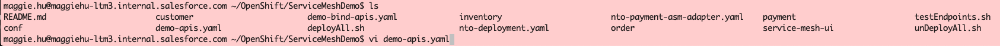

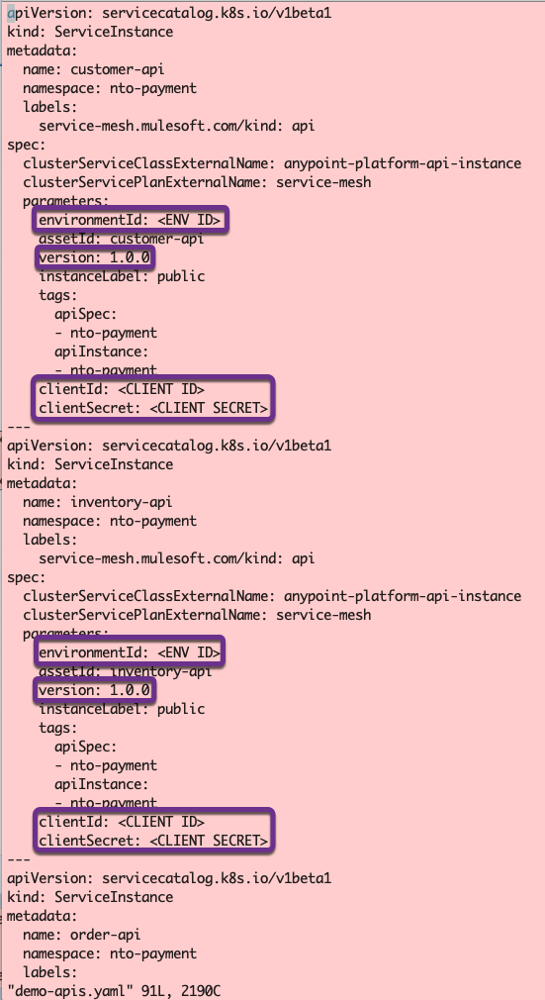

```bash
oc apply -f demo-apis.yaml
```

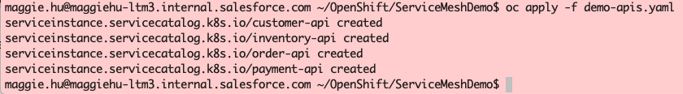

- Use the following command to monitor the progress. Wait for status to change to **Ready**

```bash
asmctl api list
```


- You can also verify that the API's have been created in Anypoint Platform. Go to Anypoint Platform and navigate to **API Manager**

    

<a id="step15"></a>
### **STEP 15**: Binding APIs with Services

- The last step is to bind the Kubernetes Services with the Anypoint Platform API's. To do this you will use the binding definition file **demo-bind-apis.yaml**. Execute the following command

```bash
oc apply -f demo-bind-apis.yaml
```


- Use the following command to monitor the progress. Wait for status to change to **Ready**

```bash
asmctl api binding list
```


- If you go to **API Management** in Anypoint Platform and refresh the page you will see that the API's are now **Active**. 


- You have completed the installation of Anypoint Service Mesh. In the next section we will walk through applying some policies against the kubernetes services.

<a id="applypolicy"></a>
## Apply API Management Policies

<a id="step16"></a>
### **STEP 16**: Apply Rate Limiting Policy to Customer API

- From the **API Management** Screen in Anypoint Platform click on the version number for **customer-api**

    

- Click **Policies** and then click **Apply New Policy**. Expand **Rate Limiting** select newest version and click **Configure Policy**. 

    

- We will configure the rate limit to be 1 call per minute. Click **Apply**

    

- You should now see your new **Rate limiting** policy.

	 

- To test this out run through the order process in the demo application. Try to run through it 2 times within a minute. The second time through you will get **Account Retrieval Failed** error.

    

- Before moving onto the next step remove the **Rate Limiting** policy.

<a id="step17"></a>
### **STEP 17**: Apply Client ID enforcement Policy to Payment API

- Navigate back to the ***API Administration** page. Click on the version number for **payment-api**.

- Click **Policies** and then click **Apply New Policy**. Expand **Client ID enforcement** select newest version and click **Configure Policy**. 

    

- Leave all defaults and click **APPLY**

	 

- You should now see your new **Client ID enforcement** policy.

	 

- Once again run through the demo application but this time you should see **Payment Authorization Failed** when you click **AUTHORIZE PAYMENT**

    


<a id="reportmonitoranalytics"></a>
## Report & Monitor API Analytics

<a id="step18"></a>
### **STEP 18**: View Analytics Reports Dashboards of Customer API & Payment API

- From **API Manager**, click on **Analytics** on the left.


- At the top, select the desired date range, filter by the APIs, and check **Include Policy Violations**


- You can also build a report for API Analytics collected from service-service communication. The API Analytics provides insights into health of managed APIs - status code, policy violations, response time and such.  
Follow [MuleSoft API Analytics Documentation](https://docs.mulesoft.com/api-manager/2.x/analytics-event-api#creating-a-report) to create an API Analytics report for all APIs and review if APIs are working as expected.


- Click on **Run** of the report, you could download the report in the browser or view the report usring curl with the report URL to look at more details.


[Violated Policy Name.csv](Violated%20Policy%20Name.csv)

<a id="step19"></a>
### **STEP 19**: View Dashboards of Customer API & Payment API
- Navigate to the **Anypoint Monitoring** from either Anypoint Platform home page, or the hamburger menu at the top left corner.

- You can click on **Built-in dashboards** on the left to check out what's populated for the Customer & Payment APIs. In the drop-down, choose the **environment**, **resource name**, and the **API version / Instance**, and click on **View**. 


- At the top right corner of the dashboard, adjust the time period and turn on Auto-Refresh for **Customer API**. 


- Repeat the above and choose **Payment API** this time and check out its Analytics as well. 


**CONGRATULATIONS!!!** You have completed installing Anypoint Service Mesh, applying policies to kubernetes services, reporting and monitoring the analytics of these non-Mule services via Anypoint Platform.

<a id="cleanup"></a>
## Cleanup (Optional)

<a id="step20"></a>
### **STEP 20**: Cleanup APIs, API Bindings, and ASM Adapter

Sometimes you may want to clean up what you've created and reuse the cluster for the same or other services or other Anypoint Platform orgs. This optional step includes some cleanup commands that may be useful.

- Use the following command to list the API Bindings:

```bash
asmctl api binding list
```

- Use the following commands to delete the API Bindings for the Customer, Inventory, Order, and Payment APIs in the nto-payment namespace:
```bash
asmctl api binding delete --namespace=nto-payment --name=customer-api-binding
```

```bash
asmctl api binding delete --namespace=nto-payment --name=inventory-api-binding
```

```bash
asmctl api binding delete --namespace=nto-payment --name=order-api-binding
```

```bash
asmctl api binding delete --namespace=nto-payment --name=payment-api-binding
```

- Use the following command to delete the Customer, Inventory, Order, and Payment APIs created in API Manager:

```bash
oc delete -f demo-apis.yaml
asmctl api list
```


- Remove any stale APIs from API Manager on Anypoint Platform.


- Remove any stale APIs from Exchange on Anypoint Platform.


- Remove the adapter if necessary

```bash
asmctl adapter delete --namespace=nto-payment --name=nto-payment-service-mesh-adapter
```